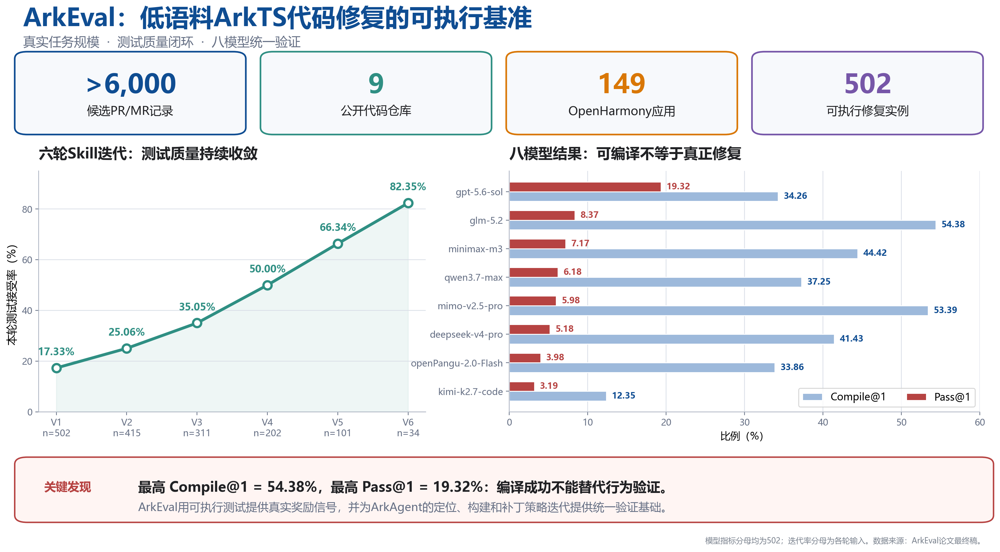
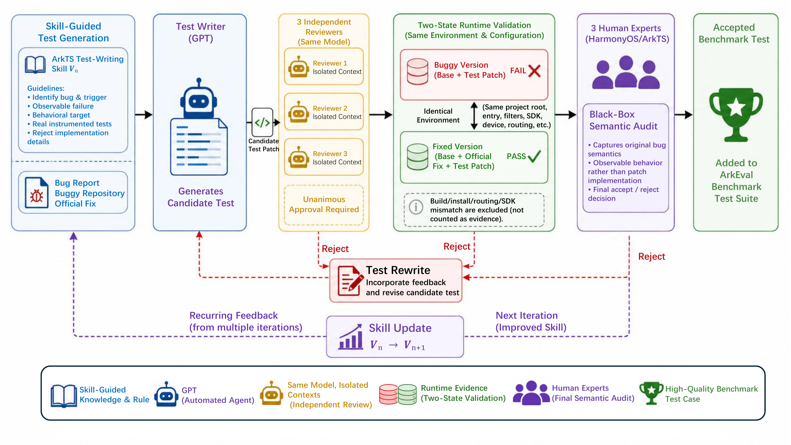
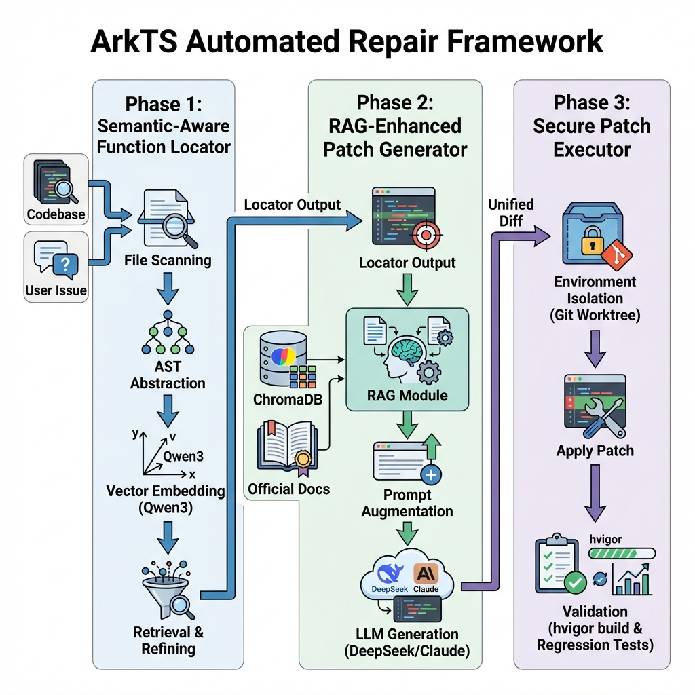

<div align="center">

# ArkEval

**面向真实 ArkTS/OpenHarmony Issue 的可执行仓库级自动程序修复基准**

[](https://conf.researchr.org/details/ase-2026/ase-2026-research-track/218/ArkEval-Benchmarking-and-Evaluating-Automated-Code-Repair-for-ArkTS)
[](https://arxiv.org/abs/2602.08866)
[](#数据集)
[](https://developer.huawei.com/consumer/cn/arkts/)

[论文页面](https://conf.researchr.org/details/ase-2026/ase-2026-research-track/218/ArkEval-Benchmarking-and-Evaluating-Automated-Code-Repair-for-ArkTS) · [arXiv](https://arxiv.org/abs/2602.08866) · [复现包](https://figshare.com/s/badd428ce21f70f244cb?file=61473181) · [快速开始](#快速开始)

</div>

ArkEval 将 ArkTS 修复从零散案例转化为可执行、可比较、可持续迭代的 LLM4Code 研究任务。它提供 502 个真实 Issue 修复实例、可追溯版本对、参考开发者补丁和行为级复现测试，同时覆盖缺陷定位、补丁生成、编译验证与真实测试执行。对于长期缺少标准评价信号的低语料语言，ArkEval 不只是一个数据集：它给出了可以用于模型比较、Agent 搜索、训练反馈和失败归因的统一实验基础。



## 核心贡献

- **据我们所知，首个面向真实 ArkTS/OpenHarmony Issue 修复的可执行仓库级基准**：502 个实例来自 9 个公开仓库，包含真实缺陷版本、参考开发者补丁与复现测试。
- **行为正确性优先**：同时报告定位、`Compile@1` 与 `Pass@1`，避免把“补丁能够编译”误认为“缺陷已经修复”。
- **严格的测试构建闭环**：测试经历 Skill 驱动生成、三个隔离 Agent 一致审核、Base FAIL / Reference PASS 两态运行验证和三名 ArkTS/OpenHarmony 开发者终审。
- **完整的 ArkTS 修复链路**：提供 ArkTS-aware 切分、Embedding 检索、两阶段模型筛选、依赖补全、Patch-only 生成、可选官方知识 RAG 与自动执行评测。
- **为 ArkTS 修复 Agent 提供奖励信号**：可执行 Oracle 能直接支持监督微调、强化学习、搜索策略和 ArkAgent 一类专用修复系统的持续迭代。

## 数据集

| 指标 | 数值 |
|---|---:|
| 候选 PR/MR 记录 | 6,000+ |
| 公开源仓库 | 9 |
| Issue-resolution 实例 | 502 |
| 官方样例应用 | 149 |
| 来自 `applications_app_samples` | 414 / 502 |
| 少于 300 行修改 | 474 / 502 |
| `.ets` 文件占比不低于 70% | 417 / 502 |
| 合并 / 关闭 / 开放记录 | 498 / 2 / 2 |

主数据文件位于 [`dataset/arkeval_dataset.jsonl`](dataset/arkeval_dataset.jsonl)。每行对应一个独立实例，主要字段包括：

```text
instance_id, org, repo, number, state, title, body, base,
resolved_issues, defect_files, fix_patch, test_patch,
fixed_tests, f2p_tests, run_result
```

其中 `fix_patch` 是经整理的参考开发者补丁，`test_patch` 是可执行复现测试；模型评测时不会向修复模型暴露这两项。

## 测试构建

测试不是从补丁中机械提取，而是围绕 Issue 描述中的外部可观察行为构建。候选测试只有在三个 Agent 一致通过、相同环境下满足 `base + test = FAIL` 与 `base + reference patch + test = PASS`，并通过三名专家的最终黑盒语义审核后，才进入基准。



六轮全基准迭代中，每轮接收率由 V1 的 `87/502 (17.33%)` 提升到 V6 的 `28/34 (82.35%)`；剩余 6 个长尾实例在定向反馈后通过相同门禁完成闭环。

## 定位与修复框架

1. 对基准缺陷版本扫描 `.ets` 与 `.ts` 文件，并进行 ArkTS-aware 结构切分。
2. 使用 Qwen3-Embedding-8B 编码代码块，在 Milvus 中检索 Top-k 候选文件。
3. 修复模型执行核心文件筛选和依赖补全，形成受约束的修复范围。
4. 模型仅输出统一 Diff；可选 RAG 只提供华为/OpenHarmony 官方语法、编译错误分析和示例代码。
5. 依次执行补丁适用性、Hvigor 编译、复现测试与可用回归测试，得到 `Compile@1` 和 `Pass@1`。



共享 Embedding 阶段在 502 个 Issue 上取得 `304/502 (60.56%)` 的候选文件 Hit@10。该值衡量 Top-10 中是否至少包含一个参考修复相关文件，不等同于最终定位准确率。

## 基准结果

下表为论文主实验：8 个模型在同一定位引导、RAG-off、单次补丁协议下完成全部 502 个实例。

| 模型 | Compile@1 | Pass@1 |
|---|---:|---:|
| mimo-v2.5-pro | 268 (53.39%) | 30 (5.98%) |
| deepseek-v4-pro | 208 (41.43%) | 26 (5.18%) |
| kimi-k2.7-code | 62 (12.35%) | 16 (3.19%) |
| minimax-m3 | 223 (44.42%) | 36 (7.17%) |
| qwen3.7-max | 187 (37.25%) | 31 (6.18%) |
| **glm-5.2** | **273 (54.38%)** | 42 (8.37%) |
| **gpt-5.6-sol** | 172 (34.26%) | **97 (19.32%)** |
| openPangu-2.0-Flash | 170 (33.86%) | 20 (3.98%) |

最高编译率和最高行为通过率由不同模型取得，说明编译成功不能替代行为级修复评价。四模型配对实验中，官方知识 RAG 带来 `4.38–11.75` 个百分点的 Compile@1 增益和 `0.80–3.19` 个百分点的 Pass@1 增益；这些结果是描述性比较，不主张统计显著性。

## 仓库结构

```text
ArkEval/
├── dataset/                    # 502 条 ArkEval 主数据
├── localization/               # ArkTS-aware 切分、Embedding 与两阶段定位
├── arkfix/                      # Patch-only 修复入口与修复引擎
│   └── repair_engine/
│       ├── config/              # ArkTS Prompt 与命令配置
│       ├── rag/                 # 官方知识索引与检索
│       ├── sweagent/            # Agent 执行核心
│       └── command_line_tools_test/
├── evaluation/                 # 编译、安装、测试与 Pass@1 评测
├── Leaderboards/               # 结果聚合与排行榜页面
├── assets/                     # README 展示图
├── run_arkts_pipeline.py       # 定位 + 修复总入口
└── requirements.txt
```

## 快速开始

### 1. 安装依赖

推荐 Windows 10/11、Python 3.11、Node.js 18+、Git、DevEco Studio、OpenHarmony SDK、HDC 与可用模拟器/设备。

```powershell
python -m venv .venv
.\.venv\Scripts\Activate.ps1
pip install -r requirements.txt
npm ci --prefix .\localization\localization_engine\ast\node
Copy-Item .env.example .env
```

随后在 `.env` 中填写模型端点、Embedding 服务与 Milvus 配置。仓库不会提供 API Key、SDK、第三方依赖缓存、模拟器镜像或修复仓库池。

### 2. 运行定位与修复

准备 `depend/repair_repo/run01/<repo>` 仓库池后，可按数据集行号执行：

```powershell
python .\run_arkts_pipeline.py `
  --dataset .\dataset\arkeval_dataset.jsonl `
  --rows 1 `
  --repo-pool .\depend\repair_repo `
  --localization-repo-pool .\depend\repair_repo\run01 `
  --model-name <model-id>
```

仅运行定位：

```powershell
python .\localization\run_localization.py `
  --dataset .\dataset\arkeval_dataset.jsonl `
  --rows 1 `
  --repo-pool .\depend\repair_repo\run01
```

### 3. 评测模型补丁

```powershell
python .\evaluation\run_llm_patch_eval.py `
  --benchmark .\dataset\arkeval_dataset.jsonl `
  --patches-dir <model-patch-directory> `
  --output <evaluation-result.json>
```

这是需要真实 OpenHarmony 工程、SDK 和设备环境的全链路评测，不支持用静态检查或补丁文本匹配替代运行结果。更完整的环境说明见各组件 README：[`localization`](localization/README.md)、[`arkfix`](arkfix/README.md) 和 [`repair engine`](arkfix/repair_engine/README.md)。

## 复现边界

- GitHub 目录提供核心源码、主数据集和展示素材，不打包约 20 GB 的 SDK、依赖缓存、仓库池与运行输出。
- 复现者需要自行安装 DevEco/OpenHarmony 工具链并恢复公开源仓库；论文复现包提供审计材料与实验记录。
- 主八模型结果均为 RAG-off；RAG 结果是独立的四模型配对实验，不与主榜混合。
- `Pass@1` 完全由自动 Oracle 判定：有现有回归套件时要求编译、复现测试和回归测试全部通过；没有现有回归套件时要求编译与复现测试通过。

## 引用

如果 ArkEval 对你的研究有帮助，请引用：

```bibtex
@inproceedings{xie2026arkeval,
  title     = {ArkEval: Benchmarking and Evaluating Automated Code Repair for ArkTS},
  author    = {Xie, Bang and Zhang, Senjian and Peng, Zhiyuan and Chen, Wei and Yin, Xin and Ying, Chenhao and Luo, Yuan},
  booktitle = {Proceedings of the 41st IEEE/ACM International Conference on Automated Software Engineering},
  year      = {2026},
  doi       = {10.1145/3832783.3837514}
}
```

## 致谢

本工作得到国家自然科学基金项目（NSFC 62402313）的部分资助。
